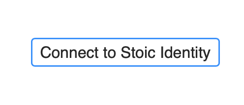
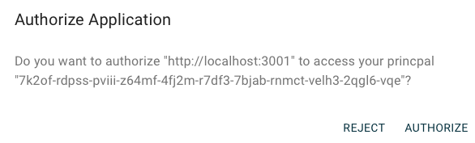
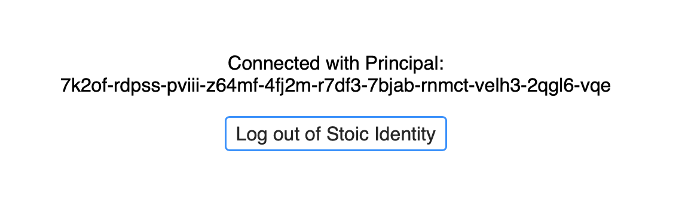

# Stoic Identity Example

Example of how to use Stoic Identity.

Very minimal, not using any component framework, just raw JavaScript (well, TypeScript) DOM interactions.

# Usage

1. Clone this repository.
2. Run the following in your terminal from this directory:

    ```sh
    npm start
    ```

3. Go to the host indicated in your terminal (probably [`localhost:3000`](http://localhost:3000)).
4. You should see the following after a quick loading screen:

    

5. After clicking that button you'll need to login to Stoic Identity (or create a new identity there).
6. Authorize this app from Stoic Identity:

    

7. Now you should see the following on this app (with your principal instead):

    

8. See `makeTransfer` in [./src/ledger.ts](./src/ledger.ts) for making actual ICP transfers from Stoic Wallets.
